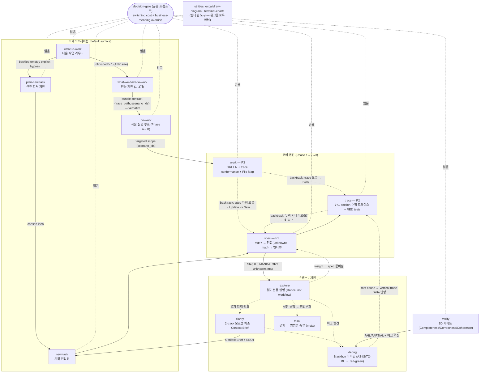
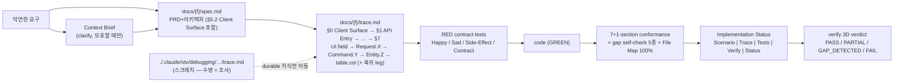

# STV Plugin — Whole-System Structure Graph

> Structural decomposition of plugins/stv (post 2026-07-14 change set).
> 결론 한 줄: **STV는 "spec→trace→work 코어 엔진"을 5개 오케스트레이션 스킬이 감싸고, 4개 스탠스가 옆에서 받치며, 모든 판단이 decision-gate 하나로 수렴하는 그래프다 — 파이프라인처럼 그려져 있지만 실제 지배 구조는 backtrack 루프(Actions not Phases)다.**

## 1. Call / Routing Graph

## 2. Artifact Flow (계약의 이동 경로)

## 3. 승격된 암묵 구조 (표면에 없지만 지배적인 것)

- ◆ **trace.md의 이중 역할** — 계약(테스트의 원천)이자 task list(Implementation Status 표). 별도 태스크 도구가 없는 이유.
- ◆ **게이트 사슬** — RED 확인 → GREEN → gap self-check(5종) → 7+1-section conformance → **File Map 100%** → spec 재검증 → finalize. "tests GREEN ≠ done"의 기계화; 테스트는 스펙의 부분집합, File Map이 전체 수정 서피스.
- ◆ **Actions not Phases** — 다이어그램은 파이프라인이지만 점선(backtrack)이 정상 경로다. upstream 먼저 고친다(spec → trace → code).
- ※ **두 개의 trace.md** — 수직 트레이스(docs/{f}/trace.md, 계약·영속)와 디버깅 트레이스(./.claude/stv/debugging/, 스크래치·폐기). 이름만 같다.
- ◆ **decision-gate 단일 수렴점** — 9개 워크플로우가 전부 같은 판별기(switching cost + business-meaning override)를 읽는다. 질문 최소화의 축.
- ◆ **Section 0이 닫는 왕복** — frontend → dto → api → service → protocol → db/cache → 응답 복귀. API Entry에서 시작하는 트레이스는 클라이언트 표면 흉내를 막지 못한다 — Section 0이 그 구멍을 막는다.

## 4. 미배치/노이즈 (silent skip 금지 규칙에 따른 명시)

- `.claude-plugin/plugin.json` — 배포 메타데이터 (구조 무관).
- `excalidraw-diagram-skill`, `using-terminal-charts` — 렌더링 유틸리티로, STV 워크플로우 그래프의 노드가 아니라 도구함. 워크플로우별 스펙 대상에서 제외.

**범례**: 실선 = 정상 호출/핸드오프 · 점선 = backtrack/조건부 전이 · `{…}` = 기계가독 계약 · ◆ = 승격된 암묵 구조 · ※ = 오해 차단.
