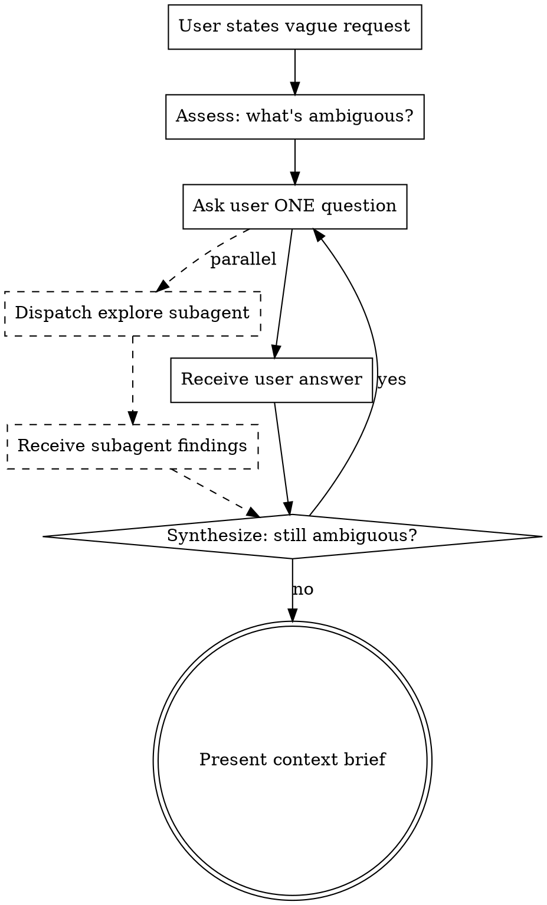

# stv:clarify: Context Brief

## The Two-Track Process

### Track 1: User Q&A (Ambiguity Resolution)

Ask the user questions to resolve ambiguity.

**Question principles:**

- One question per message
- Offer choices when possible (A/B/C)
- When a new ambiguity emerges from an answer, drill into it in the next question
- Ask "which case?" rather than "why?" — draw out concrete scenarios, not abstract intent
- If an answer contradicts a previous one, flag it immediately and realign

**Question sequence guide:**

1. **Purpose**: "What is the end goal of this work?" (what they want to achieve)
2. **Scope**: "What's included and what's excluded?" (draw boundaries)
3. **Constraints**: "Are there existing constraints that affect this?" (time, compatibility, dependencies)
4. **Success criteria**: "What should the state look like when this is done?" (verifiable outcome)
5. **Priority**: "If there are multiple paths, what matters most?" (trade-offs)

After each question, briefly update "what we've established so far."

### Track 2: Codebase Exploration (Technical Context)

Use subagents to explore the codebase. Run in parallel with user Q&A.

**How to dispatch exploration:**

Immediately after asking the user a question, launch a subagent via the Agent tool. The goal is to make the user fully understand how the work plays out in the codebase. The subagent investigates:

- Related file structure and naming conventions
- Existing implementation patterns (error handling, state management, data flow)
- Dependencies and interface boundaries
- Recent change history (relevant commits)
- Test coverage status

**Subagent prompt template:**

```
subagent_type: Explore
description: "Explore [topic] codebase"
prompt: |
  The user has requested [summarized request].

  Investigate and report on:
  1. Related files and the role of each
  2. Existing implementation patterns (is something similar already in place?)
  3. Boundary areas this work is likely to affect
  4. Recent related changes
  5. Existing test state

  Report only key findings concisely.
  Do not dump entire file contents.
```

**Processing subagent results:**

When the subagent returns findings:
1. Cross-validate against the user's answers
2. If technical constraints unknown to the user are discovered, reflect them in the next question
3. If a conflict with existing code is likely, notify the user

## Putting It Together: The Loop



**Each cycle:**

1. Receive the user's answer
2. Merge subagent results if available (if still in progress, merge in the next cycle)
3. Update the "remaining ambiguities" list
4. Pick the next question (prioritize the one that most affects scope)
5. If needed, launch additional subagents (when previous exploration revealed new areas to investigate)

## Output: Context Brief

When ambiguity is sufficiently resolved, present the user with a Context Brief. This is the skill's final deliverable.

**Context Brief format:**

```markdown
## Context Brief: [Task Title]

### Goal
[One-sentence task goal]

### Scope
- **In scope**: [Included work]
- **Out of scope**: [Explicitly excluded work]

### Technical Context
[Technical facts discovered through code exploration]
- Current implementation state
- Affected areas
- Existing patterns to follow

### Constraints
[Identified constraints]
- External constraints
- Technical constraints
- Time/priority constraints

### Success Criteria
[Specific criteria for the completed state]

### Open Questions (if any)
[Questions still open — unresolved but not blocking]

### Complexity Assessment

Assess task complexity using these 5 signals. Score each signal, then determine the routing.

| Signal | Low (1) | Medium (2) | High (3) |
|--------|---------|-----------|----------|
| **Scope breadth** | Single feature or component | 2-3 related components | 4+ components or cross-cutting concerns |
| **File impact** | ≤3 files | 4-8 files | 9+ files or across 3+ directories |
| **Interface boundaries** | Works within existing interfaces | Extends existing interfaces | Defines new interfaces or modifies contracts |
| **Dependency depth** | No ordering constraints | Linear dependency chain | Branching dependencies requiring DAG |
| **Risk surface** | No integration risk | Internal integration between components | External systems, schema changes, backward compatibility |

**Score:** [sum of signals, range 5-15]
**Verdict:** [Simple (5-8) | Complex (9-15)]
**Rationale:** [1-2 sentences explaining the dominant complexity factor]
```

## 4. Brief 완성 후
 
- Brief를 유저에게 보여주고 확인받는다
- 확인되면 즉시 다음 단계(구현, 계획, stv:debug, stv:new-task 등)로 넘어간다. (해당 작업에서 clarification.md 문서를 저장 할 것)
- Brief는 이후 작업의 SSOT가 된다
